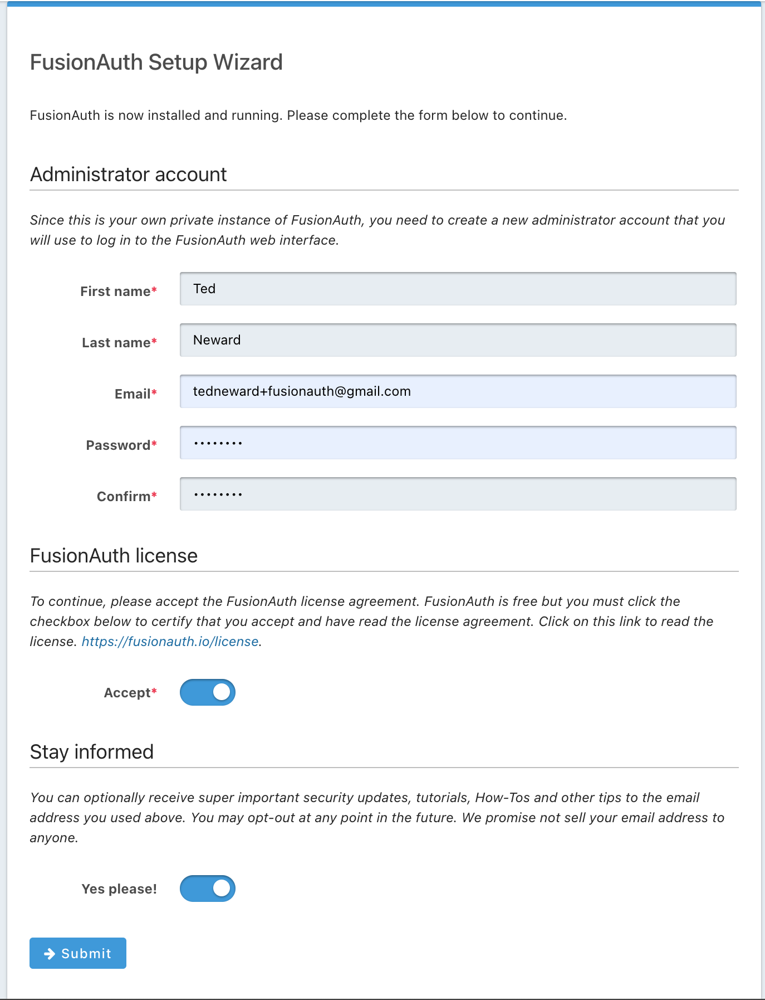
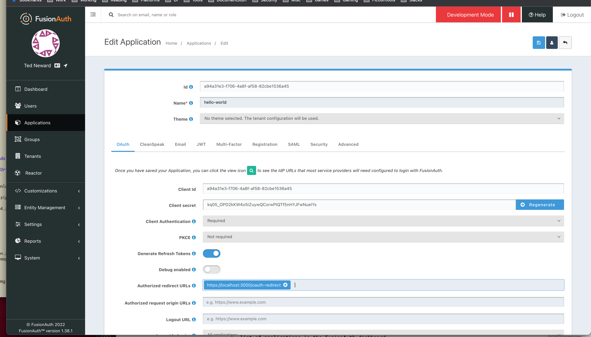

# A Guide to the Hello World of FusionAuth
In this post, we're going to explore how to add authentication to your existing application using the FusionAuth system. 

## Background
We have a very simple existing application, one which provides just a couple of web pages:

* Home page
* Secrets page (where sensitive stuff is kept and displayed)
* Public page (that anyone can look at)

For this most simple of applications, we want only people we know to be able to view the Secrets page, but anybody can see the public page.

Our server-side processing is written in NodeJS. Let's have a look at the code we have:

***`index.mjs`***
```js
// index.mjs
import express from 'express'
import fileSystem from 'fs'

const app = express()
const port = 3000

app.get('/', (req, res) => {
	res.writeHead(301, {'Location':'/index.html'})
	res.end('Home page is <a href="index.html">here</a>.')
		// Purely for those clients who don't follow 301s
})
app.get('/:page.html', (req, res) => {
    let filename = './' + req.params["page"] + '.html'
    console.log("User requested", req.params["page"], "to display; sending", filename)
	fileSystem.readFile(filename, function(error, fileContent) {
		if(error){
			res.writeHead(404, {'Content-Type': 'text/plain'})
			res.end('Page not found')
		}
		else{
			res.writeHead(200, {'Content-Type': 'text/html'})
			res.write(fileContent)
			res.end()
		}
	});
})
app.listen(port, () => {
	console.log(`App listening on port ${port}`)
})
```

Note that this is `index.mjs`, so that we can make use of ES5 modules, rather than the more traditional `require` syntax used with CommonJS. (We may be simple, but let's at least be modern about this, shall we?)

> **SIDEBAR: But what about...?** You may not be a NodeJS developer, and wondering if we could do this in Python, Ruby, Elixir, or even plain old Java or C#. Naturally, yes, the backend of our application could've been in any of a dozen different languages and hundreds of different frameworks or middleware. Keeping this as simple as we can, however, maximizes the ability for you to adapt this to your own application when you're ready to go beyond the basics of "Hello World". Any server-side technology that knows how to accept HTTP requests and send back HTTP resposes containing HTML content would work here. Even... Perl.

***`index.html`*** 
We have a home page, which will present a login link:
```html
<!doctype html>
<html>
    <title>FusionAuth: HelloWorld</title>
	<body>
		<p>Hello world! Welcome to our awesome application.</p>
		<p>Please <a href="LOGIN_PAGE">log in</a> to enjoy the awesome.</p>
	</body>
</html>
```

Normally, that href would go to our home-grown authentication page, but we want to use FusionAuth to secure our authentication. FusionAuth will present a login screen, capture the user's password, and redirect back to our application when that's all done.

***`secrets.html`***
We have a "secrets" page:
```html
<!doctype html>
<html>
	<title>FusionAuth: Really Important Secrets</title>
	<body>
		Secrets! <b>SHHHHHH!</b>
		<ul>
			<li>Darth Vader is Luke Skywalker's father.</li>
			<li>There is no special ingredient.</li>
			<li>Special sauce is just ketchup and mayo.</li>
		</ul>
	</body>
</html>
```

***`public.html`***
And we have our "public" page:
```html
<!doctype html>
<html>
	<title>FusionAuth: Greetings to Everybody!</title>
	<body>
		<p>Welcome, welcome, welcome!</p>
		<p>Our <a href="index.html">home page</a> is where the action is.
	</body>
</html>
```

`git clone` this repository and switch to the "step-0" branch if you want to follow along at home.

## Install: FusionAuth
There's multiple ways to get FusionAuth on your system--[this link]() has links to all the download options, but my personal preference is to use Docker when trying out new things. It's much easier to get the FusionAuth service (and its dependent Postgres database) up and running, and it doesn't "clog up" anything else running on my machine.

[This link]() describes how to install via Docker, but fundamentally, if you have Docker installed, it's a three-line bash exericse:

```bash
curl -fsSL https://raw.githubusercontent.com/FusionAuth/fusionauth-containers/master/docker/fusionauth/docker-compose.yml > docker-compose.yml && \
curl -fsSL https://raw.githubusercontent.com/FusionAuth/fusionauth-containers/master/docker/fusionauth/.env > .env && \
docker-compose up
```

This will download to files (`docker-compose.yml` and `.env`), then run `docker-compose` to download the Docker images specified in the YAML file and run them using the environment variables specified in `.env`. That's really it for the main install process, but there is a tiny bit of configuration you need to do once the images are downloaded and started.

You'll know FusionAuth is up and running when it prints "Starting FusionAuth HTTP server on port [9011]" as part of a log message to the terminal window in which you issued the `docker-compose` command.

## Configure: FusionAuth Setup Wizard
Once FusionAuth is up and running, we need to configure admin credentials, so that we can access the Dashboard and be able to do all the interesting and useful configuration things that admins do (like setting up applications, adding users, configuring options, and so on).

By default, FusionAuth runs on port 9011 on your local machine, so [open it](http://localhost:9011), and you should be greeted with a configuration screen like so:



This is the Setup Wizard, and it's a one-time setup to get names and credentials for the FusionAuth administrator, as well as the consent necessary to accept the license and sign up for our newsletter. Pretty straightforward stuff.

## Setup: FusionAuth Dashboard
Now, the first thing our Really Simple Application needs is a login screen, which FusionAuth can provide on our behalf. This is useful because there's a lot of little details that all need to be done correctly that, frankly, we don't want to have to deal with. We're application developers, not security experts!

So our first task is to obtain a hyperlink that we can put into `index.html` to allow users to log in. In order to get that login link, we need to add an Application to FusionAuth; fire up the FusionAuth dashboard by going [here](http://localhost:9011/admin/application/) (which will require that you log in to the dashboard first!), or if the Dashboard is already up, click on "Applications" in the left-hand well. Once you're on the Applications page, create an Application by clicking the "+" in the upper-right corner.

Each Application has (literally) hundreds of possible configuration options, but we want to keep it simple. So give the application a name (`hello-world` suffices for our purposes), and hit "Return" or click the "Save" button in the upper-right. When the application is created, FusionAuth will generate a GUID for the application's "client ID" (which we'll need in code in a second). Once the Application is saved, FusionAuth will return you to the Applications page.

We have one more step we need to take--we need to specify a "redirect URL" target for FusionAuth to redirect to when the authentication step completes. That appears on the "OAuth" page in the Application page in the FusionAuth dashboard--first in the list below "Theme" in the Edit Application dashboard--in the entry field labeled "Authorized redirect URLs". This is the URL that FusionAuth will issue from the browser to the webserver when authentication is completed (successfully or not); we need to specify a URL that our NodeJS code will recognize and handle.

Let's call it "oauth-redirect", which means then that we need to have a URL that our NodeJS code can recognize and accept.

```js
app.get('/oauth-redirect', (req, res) => {
	console.log('/oauth-redirect')
})
```

Thus, put `http://localhost:3000/oauth-redirect` into that "Authorized redirect URLs" field in the Application page:



Click the "Save" icon in the upper-right, and it takes us back to the main list of applications in the FusionAuth dashboard.

## Setup: Capture login link
With that saved, FusionAuth can now give us the link we need to use to start the login process; from the Applications dashboard page, find the line with our application `hello-world` in it, and to the right, there is a 'View' icon that displays a number of interesting elements we'll need:

(SCREENSHOT GOES HERE)

Of the information displayed here, the parts we're going to need to satisfy our simplest-login-possible scenario is the `OAuth IdP login URL`. ("IdP" is a shorthand acronym for "identity provider", the server that handles the authentication, e.g., FusionAuth.) Keep that window open for a second--we'll want to cut-and-paste here in a second.

## Code: Integrate the client application info
From that "IdP login URL" field, copy and paste the URL into `index.html`, like so:

```html
<!doctype html>
<html>
    <title>FusionAuth: HelloWorld</title>
	<body>
		<p>Hello world! Welcome to our awesome application.</p>
		<p>Please <a href="http://localhost:9011/oauth2/authorize?client_id=f73b4062-e91c-4037-8027-246fa4786e67&response_type=code&redirect_uri=http%3A%2F%2Flocalhost%3A3000%2Foauth-redirect">log in</a> to enjoy the awesome.</p>
	</body>
</html>
```

Really, that's it for the login page.

## Code: Respond to the redirect
When the user clicks that "log in" link, FusionAuth takes over and presents the page that contains the form asking for username and password. Assuming the user enters the credentials correctly, FA will then send a "code" and "userState" values to your URL of choice--that's what we entered in the "OAuth Redirect" field earlier. We can capture those values and do something with them, but for now it's sufficient to simply display that we got them:

```js
app.get('/oauth-redirect', (req, res) => {
	// What we get back:
	// code: the authorization code
	// userState: either Authenticated or AuthenticatedNotRegistered
	let code = req.query['code']
	let userState = req.query['userState']

	console.log('/oauthRedirect: code=', code, 'userState=', userState)

	res.end('You have authenticated')
})
```

## Browser: Try it out using your admin creds
At this point, assuming the application is registered in the FusionAuth database and you have at least one user in that database (which you have to--you created one when you configured the FusionAuth server to be the admin, remember?), you can test what we've got. Run the NodeJS application (`node index.mjs`), [pop open a browser](http://localhost:3000) when that's started, and click the log in link. Fill in your admin creds, and assuming you typed everything correctly, "You are authenticated" should appear.

By the way, if you still have the Dashboard open in another browser tab, you may not see the authentication page at all--you'll just be immediately routed to the redirect page! This is because FusionAuth, like most systems, sets up browser-side tokens to keep track of the fact that you already logged in a few minutes ago (what's called a *session*), and doesn't require you to log in again. Convenient! Except when we're testing. To test your application without having to log out your administrator window, open a new "incognito" window in your browser, and log in from there.

Lastly, one of the classic mistakes developers make is to do the "happy path" testing--yay, I can log in, it must all work fine!--so let's not fall into that trap. Open another incognito tab, then deliberately enter incorrect usernames or passwords. You'll notice that FusionAuth doesn't redirect to your URL, but instead brings you back around to the login page again. This is good!

## Code: Keep out the unauthenticated
If you take a moment right now to browse to our [secret page](http://localhost:3000/secrets.html), you'll see pretty quickly that it doesn't matter whether we've authenticated to the application or not, we can still see the secrets. Not great!

## Dashboard: Add a User
This is all great, but obviously it doesn't scale well: if everybody has to share the same credentials as our security administrator, something's going to break down pretty quickly. Let's add a (non-admin) user to the database.

To add users by hand to the FusionAuth database, bring up the Dashboard again, and click on "Users" in the left well. Again, the "+" icon in the upper-right adds a new user. Let's add everybody's favorite sitcom hero, Fred Flintstone, to our application. He makes use of the Bedrock community email system, so his email is `fred@bedrock.gov`, but working at the quarry hasn't let him afford a mobile phone yet. On top of that, since we don't have email configured in FusionAuth (yet), turn off "Send email to set up password", and let's give him a password already, one he'll easily remember: `pebblesflintstone`.

> **SIDEBAR: Get culture!** If you have no idea who I'm referring to in this section, Fred Flintsone was the main character of "The Flintstones", a popular animated television show in the US back in the halcyon days of black-and-white TV. It was basically the same kind of family sitcom that was popular back in the day, except set in prehistoric times in the fictional town of Bedrock, and everybody's last name and everything else's name had something to do with geology: Fred worked for Mr Slate, his best friend was Barney Rubble, and so on. And his daughter, of course, was Pebbles.

We can fill out the bottom half of the user profile (first name, Fred, last name, Flintstone, and so on), and if we're truly feeling industrious, we can find an image for him. With all that data thus specified, we can click "Save" in the upper-right again, and lo, we have created a user.

Now for the important part: Fred is a user in our system, but he's not yet *registered* for our hello-world application. He needs to be registered so that FusionAuth knows what applications he's allowed to authenticate into (and, by extension, which ones he can't). To register him, click on the "Registrations" link in the far-left of his user profile display. (If you just clicked "Save" to save him, it should already be displayed.) Click "+ Add registration", select `hello-world` from the dropdown, give him a username for this application, and click "Save" again.

> **SIDEBAR: Roles.** Astute readers following along will note that there's a field we skipped, called "roles", which--you guessed it--would be where we'd configure the roles that Fred would have while working in our application. For now, we're just doing simple authentication, without any sort of role-based access control, so we just leave it blank.

Note that we gave Fred a username for this application because there are scenarios in which different applications will have different usernames--although this won't be quite such a concern for a greenfield application, when migrating from existing systems to FusionAuth, it may be necessary (critical, even) to keep existing usernames.

## Browser: Let Fred in!
So Fred seems to be in our database, fire up the browser, point it at [our home page](http://localhost:3000) again, and click "log in". Whoops! There's a strong chance that you're taken directly to the "You have been authenticated" message, because by default the "Keep me logged in" checkbox on the login page is turned on--cookies have been set, and the session hasn't timed out yet, so you're still authenticated. Convenient for users, less so for developers!

In a later step, we'll talk about how to enable a "logout" link to allow us (and those users who are using a public/insecure browser, such as a public library or hotel's business center) to clear those settings, but for now, you can fire up an "incognito window" in your favorite browser and try again. Enter "fred" and "pebblesflintstone", and voila! Fred is now authenticated.

## Dashboard: Wilma wants to join
It's going to get complicated if we (the FusionAuth admin) have to add every single person who wants to use our awesome application, the way we added Fred, which is to say, by hand. When Wilma (Fred's wife) wants to join the app, we'll have to take time out of our day to add her, then tell her what password we've selected for her, and that'll get tedious if we have to do that very often. It would be far easier (for everybody) if we added a link by which prospective users could add themselves--and FusionAuth provides that capability, In fact, doing so requires zero code changes at all.

Open up the Application in the FusionAuth Dashboard. Select the "Registration" page (between "Multi-Factor" and "SAML" there in the middle of the page). Under "Self-service Registration", do the following:

* Set "Enabled" to on.
* Set "Type" to Basic. Advanced is for using custom forms, and the Basic one that FusionAuth works just fine for our purposes.
* Set "Confirm Password" to on. This is the typical "make the user type their password twice", to make sure they don't accidentally typo their intended password. Not obligatory, but frankly there's not much reason not to do this.
* Set "Login type" to Username. While emails are guaranteed unique, sometimes usernames are the preferred way to go, particularly if we're not planning to email the user for anything.
* Lastly, under "Registration fields", where we select which user-specific data we want to allow the user to enter and store, and which we want required, set them all to "Enabled" but leave "Required" off. This is mostly so that we can see what that form looks like without being obligated to enter in values for each and every field.

Click "Save" in the upper-right, and browse (in another incognito window) to our home page again; this time, near the bottom, we are asked if we'd like to create a new account, and now Wilma can add herself to the app's list of registered users--and we didn't have to change a single line of code to support it. Auth-as-a-Service, for the win!

But somewhat equally importantly, notice that the `userState` value we get back from FusionAuth after Wilma logs in is `Authenticated`, rather than `AuthenticatedNotRegistered` when we used our FusionAuth admin credentials. This is an interesting and important distinction when managing users across multiple applications, and you want to distinguish between those who are "registered" with the application and those who aren't (such as administrators doing behind-the-scenes work).
